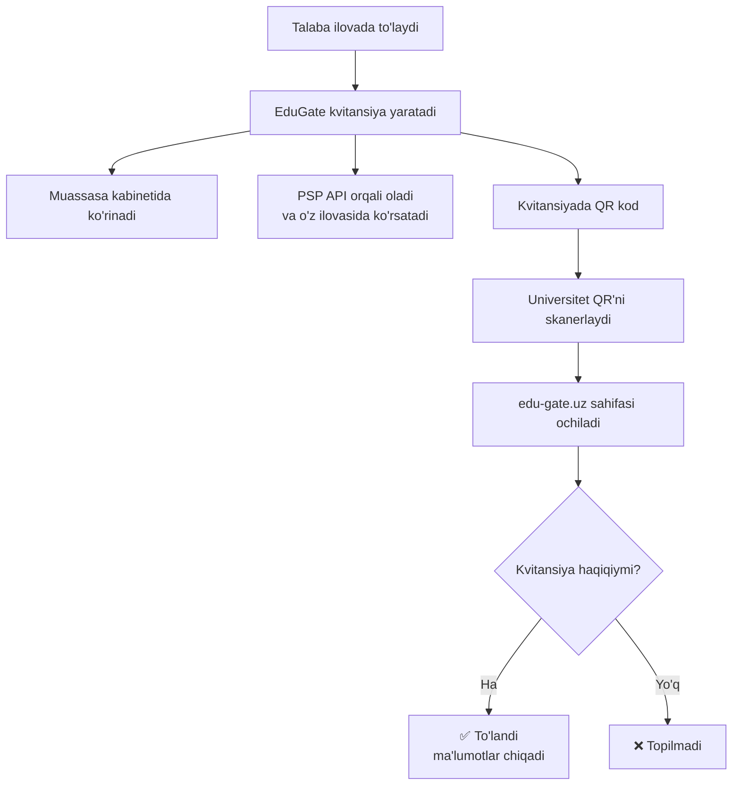

# Invoice va Kvitansiya

> Soliq.uz va my.gov.uz'dagi kabi — hujjatda QR bo'ladi, skanerlansa haqiqiyligi tekshiriladi.

---

## Ikkita hujjat, ikki xil vazifa

| | **Invoice** (hisob) | **Kvitansiya** (chek) |
|---|---|---|
| Qachon | To'lovdan **oldin** | To'lovdan **keyin** |
| Nima deydi | "Sizda 6 000 000 so'm qarz bor" | "Siz 6 000 000 so'm to'ladingiz" |
| Kim beradi | Universitet / EduGate | EduGate |
| QR bormi | Ixtiyoriy | **Ha — asosiy narsa** |

Hozircha **kvitansiyadan** boshlaymiz — u ko'proq kerak.

---

## Qanday ishlaydi



---

## Kvitansiya namunasi

```
┌────────────────────────────────────────────┐
│  EduGate                    ✅ TO'LANDI     │
│                                             │
│  Kvitansiya №   EG-2026-000186              │
│  Sana           07.08.2026   14:32          │
│                                             │
│  Muassasa       Toshkent Davlat             │
│                 Universiteti                │
│  Talaba         Yusupova Malika             │
│  Talaba ID      STU-0002                    │
│                                             │
│  Summa          6 000 000 so'm              │
│  To'lov tizimi  Click                       │
│                                             │
│           ▄▄▄▄▄▄▄  ▄▄  ▄▄▄▄▄▄▄              │
│           █ ▄▄▄ █ ▀█▄▀ █ ▄▄▄ █              │
│           █ ███ █ █▄█  █ ███ █              │
│           █▄▄▄▄▄█ ▀ ▀▀ █▄▄▄▄▄█              │
│                                             │
│  Haqiqiyligini tekshirish uchun             │
│  QR kodni skanerlang                        │
└────────────────────────────────────────────┘
```

---

## QR skanerlangandan keyin nima chiqadi

Universitet xodimi telefonini QR'ga tutadi → brauzerda **edu-gate.uz** ochiladi:

```
┌────────────────────────────────────────────┐
│  ✅  TO'LOV TASDIQLANDI                     │
│                                             │
│  Kvitansiya №   EG-2026-000186              │
│  Muassasa       Toshkent Davlat Univ.       │
│  Talaba         Yusupova Malika (STU-0002)  │
│  Summa          6 000 000 so'm              │
│  To'lov sanasi  07.08.2026  14:32           │
│                                             │
│  Tekshirildi:   07.08.2026  16:05           │
│                 edu-gate.uz                 │
└────────────────────────────────────────────┘
```

**Agar to'lov keyinchalik qaytarilgan bo'lsa**, o'sha QR quyidagini ko'rsatadi:

```
┌────────────────────────────────────────────┐
│  ❌  BEKOR QILINGAN                         │
│                                             │
│  Bu to'lov 10.08.2026 da qaytarilgan.       │
│  Kvitansiya kuchga ega emas.                │
└────────────────────────────────────────────┘
```

> **Shu yerda QR'ning butun ma'nosi.** Qog'ozda "to'landi" deb turaveradi, lekin sahifa har doim **hozirgi holatni** ko'rsatadi. Qog'ozni o'zgartirib bo'ladi, sahifani esa yo'q.

---

## Qayerda ko'rinadi

| Kim | Qayerdan oladi |
|---|---|
| To'lovchi | To'lov ilovasida (PSP ko'rsatadi) |
| Muassasa | O'z kabinetida, har bir to'lov yonida |
| PSP | API orqali havola oladi |
| Bizning qo'llab-quvvatlash | Admin paneldan topib, mijozga yuboradi |
| Universitet xodimi | QR'ni skanerlaydi |

---

## ⚠️ Bitta muhim narsa

Havolada **to'lov raqami bo'lmasligi kerak.**

❌ `edu-gate.uz/invoice/186`
✅ `edu-gate.uz/invoice/7bK9mQx2vR8nP4dL...`

**Sabab:** agar raqam ketma-ket bo'lsa (186, 187, 188...), istalgan odam raqamlarni birma-bir yozib chiqib, **barcha talabalarning ismi, universiteti va to'lov summasini** yig'ib oladi. Tasodifiy kod bilan buni qilib bo'lmaydi.

Kvitansiya raqami (`EG-2026-000186`) qog'ozda qoladi — faqat havolada ishlatilmaydi.

> Buni **boshidan** to'g'ri qilish kerak. Keyin o'zgartirish qiyin: kvitansiyalar chop etilgan, PSP'lar integratsiya qilgan bo'ladi.

---

## Bosqichlar

**1-bosqich** — kvitansiya avtomatik yaratiladi, kabinetda ko'rinadi, QR ishlaydi
**2-bosqich** — PDF yuklab olish, API orqali PSP'ga havola
**3-bosqich** — invoice (to'lovdan oldingi hisob)

---

## Muhokama uchun savollar

1. Kvitansiya rasmiy buxgalteriya hujjatimi? (universitet buxgalteriyasidan so'rash kerak)
2. Talaba ismi to'liq ko'rsatiladimi yoki qisqartirilganmi?
3. Havola qancha muddat amal qiladi?

*Batafsil texnik tavsif: `TZ-kvitansiya.md`*
