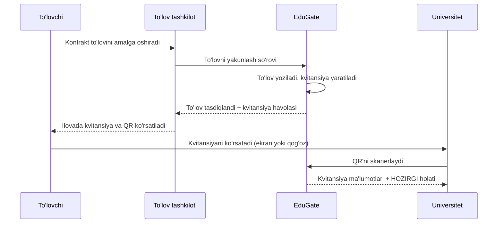

# TZ — To'lov kvitansiyasi va QR orqali tekshirish

**Holati:** loyihalashtirish (muhokama uchun)
**Sana:** 2026-08-07

---

## 1. Maqsad

To'lov yakunlangach, to'lovchiga **rasmiy tasdiq hujjati** beriladi. Uni:

- to'lov tashkiloti o'z ilovasida ko'rsatadi;
- yoki qo'ng'iroq qilgan mijozga biz yuboramiz;
- mijoz uni **universitetga ko'rsatadi**;
- universitet xodimi **QR'ni skanerlaydi** va kvitansiya haqiqiyligini bizning saytimizda tekshiradi.

Asosiy g'oya: **qog'oz eskiradi, sahifa esa yo'q.** PDF — bu bir lahzaning nusxasi. QR esa har doim **hozirgi holatni** ko'rsatadi. Agar to'lov keyinchalik qaytarilgan bo'lsa, qog'ozda "to'landi" deb tursa ham, sahifada "bekor qilingan" chiqadi.

---

## 2. Foydalanish stsenariylari

| Kim | Qanday oladi | Nima uchun |
|---|---|---|
| To'lovchi (ota-ona/talaba) | To'lov tashkiloti ilovasida havola yoki QR | O'zida saqlash, universitetga ko'rsatish |
| To'lov tashkiloti | API orqali kvitansiya havolasini oladi | O'z ilovasida ko'rsatish |
| EduGate qo'llab-quvvatlash | Admin paneldan topadi | Qo'ng'iroq qilgan mijozga yuborish |
| Universitet xodimi | QR'ni skanerlaydi | To'lov haqiqiyligini tekshirish |
| Muassasa buxgalteri | O'z kabinetidan | Hisobot va arxiv uchun |

---

## 3. Asosiy oqim



### Qadamlar

1. To'lov muvaffaqiyatli yakunlanadi.
2. Tizim avtomatik ravishda kvitansiya yaratadi — alohida so'rovsiz.
3. Kvitansiyaga **takrorlanmaydigan maxfiy havola** biriktiriladi.
4. To'lov tashkilotiga javobda kvitansiya havolasi qaytariladi.
5. To'lovchi havolani ochadi: veb-sahifa yoki PDF yuklab olish.
6. Universitet QR'ni skanerlaydi → o'sha sahifa ochiladi.
7. Sahifada holat **real vaqtda** ko'rsatiladi.

---

## 4. Kvitansiya tarkibi

### Ko'rsatiladi

- EduGate logotipi va "Tekshirilgan to'lov" belgisi
- Kvitansiya raqami (masalan `EG-2026-000186`)
- To'lov sanasi va vaqti
- Ta'lim muassasasi nomi
- Talaba: F.I.Sh. va talaba raqami
- To'lov summasi
- To'lov tashkiloti nomi
- **Holati:** To'landi / Qaytarilgan / Bekor qilingan
- Tekshirilgan vaqt (sahifa ochilgan payt)

### Ko'rsatilmaydi

- **Komissiya summasi** — bu bizning muassasa bilan munosabatimiz, to'lovchiga aloqasi yo'q
- Muassasaning bank rekvizitlari
- To'lov tashkilotining ichki raqamlari
- Talabaning telefon raqami, ota-ona ma'lumotlari
- Boshqa to'lovlar yoki qolgan qarz

> **Sabab:** kvitansiya universitet xodimiga ko'rsatiladi. Unga faqat "shu talaba, shu summa, haqiqiy" degan javob kerak. Qolgani ortiqcha.

---

## 5. Havola va QR

### Havola ko'rinishi

```
https://edu-gate.uz/chek/{maxfiy-kod}
```

**Maxfiy kod** — tasodifiy, taxmin qilib bo'lmaydigan uzun satr (32+ belgi).

### Nima uchun ketma-ket raqam EMAS

Agar havola `.../chek/186` bo'lsa, istalgan odam 1 dan 100000 gacha yozib chiqib, **barcha talabalarning ismi, universiteti va to'lov summasini** yig'ib olishi mumkin. Bu shaxsiy ma'lumotlar sizib chiqishi.

Tasodifiy kod bilan buni qilib bo'lmaydi — variantlar soni shunchalik ko'pki, topish imkonsiz.

**Muhim:** kvitansiya raqami (`EG-2026-000186`) ketma-ket bo'lishi mumkin va hujjatda chop etiladi — lekin **havolada ishlatilmaydi**.

---

## 6. Xavfsizlik

Bu bo'lim eng muhimi. Sahifa ochiq — ya'ni istalgan odam kira oladi. Shuning uchun har bir himoya qatlami kerak.

### 6.1. Taxmin qilishdan himoya

| Chora | Nima qiladi |
|---|---|
| Uzun tasodifiy kod | Havolani taxmin qilishni imkonsiz qiladi |
| Ketma-ket raqam ishlatmaslik | Ro'yxatni ketma-ket yig'ib olishning oldini oladi |
| Topilmagan holatda bir xil javob | "Bunday kvitansiya yo'q" — sababini oshkor qilmaydi |
| Bir xil javob vaqti | Javob tezligiga qarab kod to'g'ri/noto'g'riligini bilib bo'lmaydi |

### 6.2. So'rovlar cheklovi (rate limiting)

Uch qatlam:

**a) IP bo'yicha oddiy cheklov**
- Daqiqasiga 20 so'rov
- Soatiga 200 so'rov
- Oshib ketsa — vaqtinchalik bloklash

**b) Noto'g'ri kodlar bo'yicha alohida cheklov** — bu asosiy signal
- Haqiqiy foydalanuvchi to'g'ri havolani ochadi
- Kod tanlayotgan odam **doim xato qiladi**
- Bir IP'dan ketma-ket 10 ta noto'g'ri kod → 1 soatga bloklash
- Bloklash muddati takrorlanishda uzayadi

**c) Umumiy cheklov**
- Butun tizim bo'yicha soatiga maksimal so'rovlar soni
- Taqsimlangan hujumda (ko'p IP) ham himoya bo'ladi

### 6.3. Kuzatuv va ogohlantirish

- Har bir noto'g'ri so'rov yoziladi: vaqt, IP, kod
- Ketma-ket ko'p xato aniqlansa → **Telegram guruhga ogohlantirish**
- Admin panelda "shubhali faoliyat" ro'yxati

### 6.4. Soxtalashtirishdan himoya

Eng katta xavf: kimdir kvitansiya rasmini **Photoshop'da o'zgartirib**, universitetga ko'rsatadi.

Himoya:
- Universitet **rasmga emas, QR'ga qaraydi** — sahifa bizning serverdan keladi
- Sahifada tekshirilgan vaqt ko'rsatiladi → eski skrinshotni ajratib bo'ladi
- Sahifa faqat `edu-gate.uz` domenida ochiladi (universitet xodimi manzilga qarashi kerak)
- Kvitansiyada "haqiqiyligini QR orqali tekshiring" yozuvi bo'ladi

### 6.5. Shaxsiy ma'lumotlar

- Sahifa qidiruv tizimlariga **indekslanmaydi**
- Faqat kerakli minimum ko'rsatiladi (4-bo'limga qarang)
- Havola cheksiz amal qiladimi yoki muddati bormi — **ochiq savol** (8-bo'limga qarang)

### 6.6. Holat yangiligi

- Sahifa har safar **bazadan hozirgi holatni** oladi, keshdan emas
- To'lov qaytarilgan bo'lsa — darhol "BEKOR QILINGAN" chiqadi, qizil rangda
- PDF'da esa yaratilgan sana ko'rsatiladi va "hozirgi holatni QR orqali tekshiring" yozuvi turadi

---

## 7. Texnik komponentlar (yuqori darajada)

1. **Kvitansiya yozuvi** — to'lov yakunlanganda avtomatik yaratiladi. To'lov ma'lumotlarining nusxasi (snapshot), chunki keyin talaba ismi o'zgarishi mumkin, kvitansiya esa o'zgarmasligi kerak.
2. **Ochiq tekshirish sahifasi** — autentifikatsiyasiz, cheklovlar bilan himoyalangan.
3. **PDF generatsiya** — o'sha ma'lumotlardan, yuklab olish uchun.
4. **QR generatsiya** — havolani QR'ga aylantiradi, PDF va sahifaga joylashtiriladi.
5. **API kengaytmasi** — to'lov tashkiloti kvitansiya havolasini olishi uchun.
6. **Admin qidiruv** — qo'llab-quvvatlash xodimi to'lov bo'yicha kvitansiyani topishi uchun.
7. **Cheklov va kuzatuv qatlami** — 6-bo'limdagi himoyalar.

---

## 8. Ochiq savollar (qaror kerak)

| Savol | Variantlar | Kim hal qiladi |
|---|---|---|
| Havola muddati | Cheksiz / 1 yil / o'quv yili oxirigacha | Biznes |
| Talaba F.I.Sh. to'liq ko'rsatiladimi | To'liq / qisqartirilgan (`Yusupova M. B.`) | Biznes + huquq |
| PDF tili | Faqat o'zbek / to'lovchi tanlagan til | Biznes |
| Kvitansiya raqami formati | `EG-2026-000186` / boshqa | Biznes |
| Muassasa muhri/imzosi kerakmi | Ha / yo'q | Universitetlar bilan |
| Qaytarilgan to'lov kvitansiyasi | O'chiriladi / "bekor qilingan" bo'lib qoladi | Biznes (tavsiya: qoladi) |
| Rasmiy hujjat maqomi | Soliq/buxgalteriya uchun yaroqlimi | Huquqshunos |

> **Eng muhim savol — oxirgisi.** Agar kvitansiya rasmiy moliyaviy hujjat sifatida ishlatilsa, unga qo'yiladigan talablar butunlay boshqacha bo'lishi mumkin. Buni universitet buxgalteriyasi bilan aniqlash kerak.

---

## 9. Bosqichlar

**1-bosqich — asosiy funksiya**
- Kvitansiya avtomatik yaratiladi
- Veb-sahifa (QR bilan)
- Asosiy cheklovlar (6.1, 6.2)

**2-bosqich — tarqatish**
- PDF yuklab olish
- API orqali to'lov tashkilotiga havola
- Admin panelda qidiruv

**3-bosqich — kuzatuv**
- Shubhali faoliyat jurnali
- Telegram ogohlantirishlar
- Muassasa kabinetida kvitansiyalar ro'yxati

---

## 10. Bog'liqliklar

- **To'lovni qaytarish funksiyasi hali yo'q.** Kvitansiyada "bekor qilingan" holati bor, lekin uni yuzaga keltiradigan mexanizm qurilmagan. Kvitansiyani hozir qilsa bo'ladi, lekin bu holat to'lov qaytarish qurilgunga qadar amalda ishlamaydi.
- Elektron pochta ishlaydi — kvitansiyani pochta orqali yuborish mumkin.
